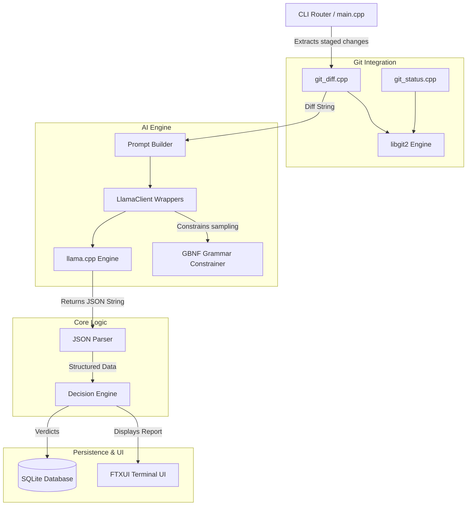

# 🚀 mygit — The Ultimate AI-Powered Code Reviewer

`mygit` is a blazingly fast, C++20-native CLI wrapper around Git. It enforces a strict, local LLM-powered code review pipeline **before** letting you push or commit your code. 

By running inferences entirely on your own hardware via `llama.cpp` and `libgit2`, `mygit` guarantees **total code privacy**, **zero network latency**, and **unparalleled reliability** through grammar-constrained AI outputs.

---

## 🌟 Key Features & Innovations

### 🧠 Local AI Inference (llama.cpp)
No cloud, no API keys, no monthly fees, no network calls. `mygit` loads and runs `.gguf` language models entirely locally.
- **Hardware Acceleration:** Seamlessly offloads layers to the GPU (via CUDA/Vulkan) or falls back to highly optimized CPU inference.
- **Persistent Context:** The `LlamaClient` object manages its own KV cache and context, avoiding model reloading penalties across consecutive operations.

### 🛡️ Grammar-Constrained JSON (GBNF)
Instead of relying on fragile "prompt engineering" to get the AI to output valid JSON, `mygit` uses **GBNF (GGML BNF) grammars** directly at the sampling level. 
- The model is physically constrained and is mathematically incapable of generating anything other than our strictly defined JSON schema.
- **Zero parsing errors.** The JSON parser receives perfectly structured JSON objects every single time.

### ⛔ Decision Engine & Verdicts
The code review parses the AI's feedback into structured severities (`critical`, `high`, `medium`, `low`).
- **Blocking Commits:** If the AI detects a `critical` severity issue (like a security vulnerability, hardcoded secret, or fatal bug), `mygit` immediately halts the `commit` or `push` process.
- **Force Override:** Developers retain ultimate control. Passing the `--force-ai` flag explicitly overrides the AI's verdict.

### 📝 Auto-Generated Conventional Commits
Forget staring at a blank terminal trying to summarize your changes. 
- Running `mygit commit` (without the `-m` flag) triggers the AI to analyze your staged diff and generate a **Conventional Commit** message (e.g., `feat(auth): add JWT validation`).
- **Interactive Flow:** You are prompted with the generated message: `Use this? [Y/n/e to edit]`.
  - `Y`: Uses the generated message instantly.
  - `e`: Opens your `$EDITOR` with the message pre-filled for tweaking.
  - `n`: Falls back to standard Git editor behavior.

### 📂 Native Git Integration (libgit2)
`mygit` does not shell out to the `git` CLI executable using brittle `popen()` calls.
- **Direct C API:** Uses `libgit2` to directly traverse the Git object database, query the index, and calculate tree-to-index diffs purely in memory.
- **RAII Memory Safety:** All C-style `libgit2` pointers (`git_repository`, `git_diff`, `git_tree`) are wrapped in C++ `std::unique_ptr` with custom deleters, guaranteeing zero memory leaks.

### 💾 SQLite Review Memory System
Every review verdict is persisted to a local SQLite database (`~/.mygit/mygit.db`), establishing a long-term memory system.
- **Schema Auto-Creation:** `CREATE TABLE IF NOT EXISTS` ensures zero setup overhead.
- **ACID Transactions:** Inserts into the `reviews` and `issues` tables are bound by `BEGIN` and `COMMIT` block limits to ensure atomicity.
- **Prepared Statements:** 100% parameter-bound queries (`sqlite3_bind_*`) prevent SQL injection and ensure blazing fast writes.
- **View History:** The `mygit history` command renders a beautiful, colored ASCII table of your last 10 reviews using the **FTXUI** library.

---

## 🏗️ System Architecture

`mygit` is built using a highly modular C++20 architecture. Below is a high-level component diagram illustrating how data flows from the CLI to the underlying LLM and Git repository.



---

## 🔄 The Review Workflow

Here is exactly what happens when you run `mygit commit`:


---

## 🛠️ Commands

| Command | Description |
|---------|-------------|
| `mygit setup` | Interactive prompt to configure your model path and GPU layer count. |
| `mygit install` | Self-installs the executable to `~/.mygit/bin` and updates your system `PATH`. |
| `mygit review` | Analyzes staged changes and prints a colored report to the terminal. |
| `mygit commit` | Runs a review. If it passes, generates a commit message, and commits. |
| `mygit commit -m "msg"` | Runs a review. If it passes, commits using your provided message. |
| `mygit push <remote> <branch>` | Runs a review. If it passes, pushes the code upstream. |
| `mygit history` | Displays a table of your most recent AI reviews and verdicts. |

> **Override Flag:** Append `--force-ai` to `commit` or `push` to bypass blocking issues.

---

## ⚙️ Prerequisites & Setup

1. **Compiler:** C++20 compatible compiler (MSVC 19.3+, GCC 13+, Clang 17+)
2. **Build System:** CMake 3.21+ & Ninja
3. **Package Manager:** [vcpkg](https://github.com/microsoft/vcpkg) installed and bootstrapped.

### Building from Source

```powershell
git clone <this repo>
cd AI_code_reviewer_git

# Configure CMake (vcpkg will automatically fetch libgit2, llama.cpp, SQLite, FTXUI, etc.)
cmake --preset default

# Build the executable
cmake --build build/default
```

### Configuration & Models

You must provide `mygit` with a compatible `.gguf` model. (We recommend [Qwen2.5-Coder-1.5B-Instruct](https://huggingface.co/Qwen/Qwen2.5-Coder-1.5B-Instruct-GGUF) for lightning-fast, high-quality local reviews).

Run the setup command to configure the model path and GPU layers (use `99` to offload the entire model to the GPU for maximum speed):

```powershell
.\build\default\mygit.exe setup
```

Once configured, install `mygit` to your system PATH:

```powershell
.\build\default\mygit.exe install
```

Restart your terminal, and you can now run `mygit` from anywhere!
