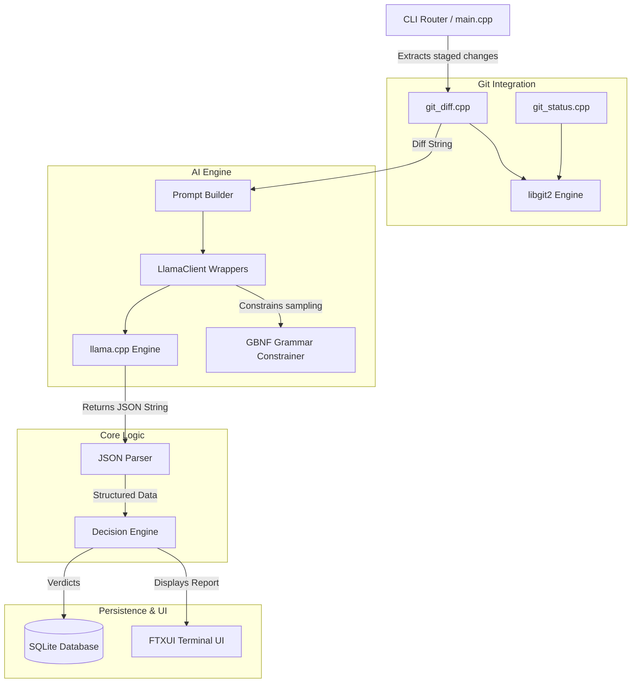
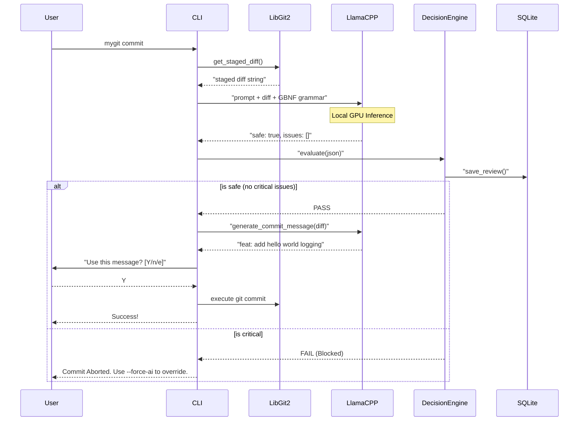

# mygit - The Ultimate AI-Powered Code Reviewer


Please do read architecture_review.md file to know the scope of project and the potential improvements it can have

When I set out to build mygit, my primary goal was to create a local LLM code reviewer that did not compromise on speed, privacy, or reliability. I quickly hit my first major roadblock: using basic shell commands to extract git diffs proved incredibly brittle and prone to unpredictable parsing errors across different operating systems. To solve this, I completely ripped out the shell integrations and natively embedded libgit2 into the project. This allowed the tool to interface directly with the Git object database, pulling the exact index structures straight from memory without any subshell overhead.

The next massive hurdle was the unreliability of LLM outputs. Asking an AI model to return JSON usually results in random markdown blocks, trailing commas, or complete hallucinations that crash the parser. To fix this, I deeply integrated llama.cpp and utilized GGML BNF (GBNF) grammars. By applying this grammar at the sampling layer, the model is mathematically forced to adhere strictly to the expected JSON schema. This completely eliminated parsing errors, allowing the decision engine to accurately and safely block commits based on severity levels.

mygit is a blazingly fast, C++20-native CLI wrapper around Git. It enforces a strict, local LLM-powered code review pipeline before letting you push or commit your code. By running inferences entirely on your own hardware via llama.cpp and libgit2, mygit guarantees total code privacy, zero network latency, and unparalleled reliability through grammar-constrained AI outputs.

## Key Features & Innovations

### Local AI Inference (llama.cpp)
No cloud, no API keys, no monthly fees, no network calls. mygit loads and runs .gguf language models entirely locally.
- Hardware Acceleration: Seamlessly offloads layers to the GPU (via CUDA/Vulkan) or falls back to highly optimized CPU inference.
- Persistent Context: The LlamaClient object manages its own KV cache and context, avoiding model reloading penalties across consecutive operations.

### Grammar-Constrained JSON (GBNF)
Instead of relying on fragile "prompt engineering" to get the AI to output valid JSON, mygit uses GBNF (GGML BNF) grammars directly at the sampling level. 
- The model is physically constrained and is mathematically incapable of generating anything other than our strictly defined JSON schema.
- Zero parsing errors. The JSON parser receives perfectly structured JSON objects every single time.

### Decision Engine & Verdicts
The code review parses the AI's feedback into structured severities (critical, high, medium, low).
- Blocking Commits: If the AI detects a critical severity issue (like a security vulnerability, hardcoded secret, or fatal bug), mygit immediately halts the commit or push process.
- Force Override: Developers retain ultimate control. Passing the --force-ai flag explicitly overrides the AI's verdict.

### Auto-Generated Conventional Commits
Forget staring at a blank terminal trying to summarize your changes. 
- Running mygit commit (without the -m flag) triggers the AI to analyze your staged diff and generate a Conventional Commit message (e.g., feat(auth): add JWT validation).
- Interactive Flow: You are prompted with the generated message: Use this? [Y/n/e to edit].
  - Y: Uses the generated message instantly.
  - e: Opens your $EDITOR with the message pre-filled for tweaking.
  - n: Falls back to standard Git editor behavior.

### Native Git Integration (libgit2)
mygit does not shell out to the git CLI executable using brittle popen calls.
- Direct C API: Uses libgit2 to directly traverse the Git object database, query the index, and calculate tree-to-index diffs purely in memory.
- RAII Memory Safety: All C-style libgit2 pointers (git_repository, git_diff, git_tree) are wrapped in C++ std::unique_ptr with custom deleters, guaranteeing zero memory leaks.

### Repository-Aware Context (RAG)
mygit can retrieve semantically related code from the rest of your repository and feed it into the review/commit-message prompts, so the AI sees more than just the raw diff.
- Zero-RAG fallback by default: until an embedding model is present, `RagOrchestrator::available()` is `false` and every command behaves exactly as it did before — no crashes, no setup required.
- BPE tokenizer + ONNX Runtime: `rag/bpe_tokenizer.cpp` implements a byte-level BPE tokenizer compatible with HuggingFace `tokenizer.json` files, and `rag/embedder.cpp` runs the actual embedding model through ONNX Runtime (CPU by default, optional CUDA execution provider).
- FAISS-backed vector store: indexed code units are embedded and searched via FAISS for fast nearest-neighbor retrieval at commit time.
- See [RAG Setup Guide](#rag-setup-guide) below to turn this on.

### SQLite Review Memory System
Every review verdict is persisted to a local SQLite database (~/.mygit/mygit.db), establishing a long-term memory system.
- Schema Auto-Creation: CREATE TABLE IF NOT EXISTS ensures zero setup overhead.
- ACID Transactions: Inserts into the reviews and issues tables are bound by BEGIN and COMMIT block limits to ensure atomicity.
- Prepared Statements: Parameter-bound queries (sqlite3_bind) prevent SQL injection and ensure blazing fast writes.
- View History: The mygit history command renders a beautiful, colored ASCII table of your last 10 reviews using the FTXUI library.

## System Architecture

mygit is built using a highly modular C++20 architecture. Below is a high-level component diagram illustrating how data flows from the CLI to the underlying LLM and Git repository.



## The Review Workflow

Here is exactly what happens when you run mygit commit:



## Commands

| Command | Description |
|---------|-------------|
| `mygit setup` | Interactive prompt to configure your model path and GPU layer count. |
| `mygit install` | Self-installs the executable to ~/.mygit/bin and updates your system PATH. |
| `mygit review` | Analyzes staged changes and prints a colored report to the terminal. |
| `mygit commit` | Runs a review. If it passes, generates a commit message, and commits. |
| `mygit commit -m "msg"` | Runs a review. If it passes, commits using your provided message. |
| `mygit push <remote> <branch>` | Runs a review. If it passes, pushes the code upstream. |
| `mygit history` | Displays a table of your most recent AI reviews and verdicts. |

> **Override Flag:** Append `--force-ai` to `commit` or `push` to bypass blocking issues.

## Prerequisites & Setup

1. **Compiler:** C++20 compatible compiler (MSVC 19.3+, GCC 13+, Clang 17+)
2. **Build System:** CMake 3.21+ & Ninja
3. **Package Manager:** vcpkg installed and bootstrapped.

### Building from Source

```powershell
git clone <this repo>
cd AI_code_reviewer_git

# Configure CMake (vcpkg will automatically fetch libgit2, llama.cpp, SQLite, FTXUI, etc.)
cmake --preset default

# Build the executable
cmake --build build/default
```

### Configuration & Models

You must provide mygit with a compatible .gguf model. (We recommend Qwen2.5-Coder-1.5B-Instruct for lightning-fast, high-quality local reviews).

Run the setup command to configure the model path and GPU layers (use 99 to offload the entire model to the GPU for maximum speed):

```powershell
.\build\default\mygit.exe setup
```

Once configured, install mygit to your system PATH:

```powershell
.\build\default\mygit.exe install
```

Restart your terminal, and you can now run mygit from anywhere!

## RAG Setup Guide

By default, mygit runs in **zero-RAG fallback mode**: `rag/embedder.cpp` looks for `models/embedding_model.onnx` and `models/tokenizer.json` at startup, and if either is missing it logs a one-line warning and every command behaves exactly as it did without RAG. Nothing else changes and nothing crashes. This section walks through turning real retrieval on, and (optionally) accelerating it with your GPU.

### Step 1 — Get a real embedding model (required for RAG)

`RagOrchestrator::available()` flips to `true` automatically once both files below exist — indexing kicks in on the next `mygit commit`, and retrieved context starts showing up in commit-message/review prompts. **No rebuild is needed for this step** — the paths are read at runtime.

1. Download an embedding model checkpoint from HuggingFace. This has been tested against [Qodo-Embed-1-1.5B](https://huggingface.co/Qodo/Qodo-Embed-1-1.5B) (a Qwen2.5-Coder-based embedder); `Qwen2.5-Coder-1.5B-Embed`-style models should also work as long as they're a standard encoder (non-causal) model loadable via `AutoModel`/`AutoTokenizer`.

   ```powershell
   # from the repo root
   git lfs install
   git clone https://huggingface.co/Qodo/Qodo-Embed-1-1.5B model_customization/Qodo-Embed-1-1.5B
   ```

2. Set up a Python environment with the export dependencies (PyTorch, transformers, ONNX, ONNX Runtime):

   ```powershell
   python -m venv model_customization/venv
   model_customization\venv\Scripts\pip install torch transformers onnx onnxruntime
   ```

3. Run the export script. It traces the HuggingFace model straight to ONNX and copies the tokenizer alongside it:

   ```powershell
   model_customization\venv\Scripts\python scripts\export_embedding_model_onnx.py
   ```

   This produces `models/embedding_model.onnx` (plus, for larger models, a set of sidecar weight files next to it — ONNX's external-data format for models over ~2GB; keep the whole `models/` directory together, don't move just the `.onnx` file) and `models/tokenizer.json`.

4. That's it — run `mygit commit` as usual. If you want to confirm it's working, watch stderr for the absence of any `[rag] ...falling back...` warning.

> **Model-specific export notes:** if you use a different HF checkpoint with custom `trust_remote_code` modeling code, you may need to tweak `scripts/export_embedding_model_onnx.py` — in particular `model.config.use_cache = False` and `attn_implementation="eager"` were needed to work around a newer-`transformers`-vs-older-modeling-code incompatibility and an SDPA tracing bug respectively. The export script's `torch.onnx.export` call expects the model to expose a standard `last_hidden_state` (or single-tensor) output; `rag/embedder.cpp` resolves input/output tensor names from the ONNX graph itself, so it isn't hardcoded to one model's export conventions.

### Step 2 — GPU-accelerated embeddings (optional)

Only worth doing once you have a real model to embed (Step 1). Without this, embeddings run on CPU — fully functional, just slower on large repos.

**cuDNN**: install it manually from [developer.nvidia.com/cudnn](https://developer.nvidia.com/cudnn) (free NVIDIA account, small download — this step is gated behind login and can't be automated). Extract it so `cudnn.h`/`cudnn64_*.dll`/`cudnn.lib` land inside your existing CUDA Toolkit install tree (e.g. `C:\Program Files\NVIDIA GPU Computing Toolkit\CUDA\v13.x\`).

**Rebuild onnxruntime with CUDA.** vcpkg builds ONNX Runtime from source when the `onnx-cuda` feature is requested, and getting a clean build depends heavily on your exact CUDA/MSVC toolchain versions. This repo ships a **vcpkg overlay port** at [vcpkg-overlays/onnxruntime/](vcpkg-overlays/onnxruntime/) with fixes discovered while building against CUDA 13.3 + a pre-release MSVC toolset — read its `portfile.cmake` comments if you hit a build error, since your exact combination of CUDA/MSVC/onnxruntime versions may need different (or no) patches:

- Pins `CMAKE_CUDA_ARCHITECTURES` to your GPU's actual compute capability instead of onnxruntime's default multi-arch list (which includes architectures CUDA 13+ dropped support for). **Edit `86-real` in `vcpkg-overlays/onnxruntime/portfile.cmake` to match your GPU** — check yours with `nvidia-smi --query-gpu=name,compute_cap --format=csv`.
- Adds `/Zc:preprocessor` (CUDA 13's CCCL headers require MSVC's conforming preprocessor).
- Defines `__NV_NO_VECTOR_DEPRECATION_DIAG` (CUDA 13 soft-deprecated some vector types onnxruntime 1.23.2 still uses; this is NVIDIA's own official suppression for it).
- Sets `onnxruntime_DISABLE_CONTRIB_OPS=ON` — mygit's embedder only ever uses standard ONNX ops (verify with `onnx.load(...).graph.node` on your exported model if you're unsure), so this skips onnxruntime's LLM-serving-specific contrib ops (flash-attention, MoE, etc.) entirely, at zero functional cost. It also happens to route around a couple of build breaks in that code specific to bleeding-edge toolchains.
- A small source patch (`fix-concat-link.patch`) adding an `extern template` to one onnxruntime header, working around an optimizer bug in newer/preview MSVC toolsets that discards an explicit template instantiation as "unreferenced."

To build:

```powershell
# From a "Developer PowerShell for VS 2022" (or run vcvarsall.bat x64 first) -
# a plain shell may be missing Windows SDK lib paths (winhttp.lib etc).

$env:VCPKG_OVERLAY_PORTS = "<repo>\vcpkg-overlays"

# VCPKG_INSTALLED_DIR redirects vcpkg's install/buildtree root to a short path
# (e.g. E:\vi) - onnxruntime ships some very long checked-in filenames that
# combined with vcpkg's normal deep build path can exceed Windows' 260-char
# MAX_PATH limit. Skip this flag if your repo is already at a short path.
cmake --preset default -DVCPKG_MANIFEST_FEATURES=onnx-cuda -DMYGIT_ENABLE_ONNX_CUDA=ON -DVCPKG_INSTALLED_DIR=E:/vi

cmake --build build/default --target mygit
```

This is a long rebuild the first time — vcpkg's `onnxruntime[cuda]` feature compiles onnxruntime from source. `rag/embedder.cpp` requests the CUDA execution provider under `#ifdef MYGIT_ONNXRUNTIME_CUDA` and silently falls back to CPU if CUDA session creation fails for any reason, so a partially-working GPU setup degrades gracefully rather than crashing.

**Memory note:** onnxruntime's flash-attention/CUTLASS kernels (already skipped above via `onnxruntime_DISABLE_CONTRIB_OPS`) are extremely RAM-hungry per translation unit and can OOM-crash a parallel build on machines with ~16GB RAM or less. If you re-enable contrib ops for some reason and hit that, reduce build parallelism or add more RAM before increasing `-j`.
