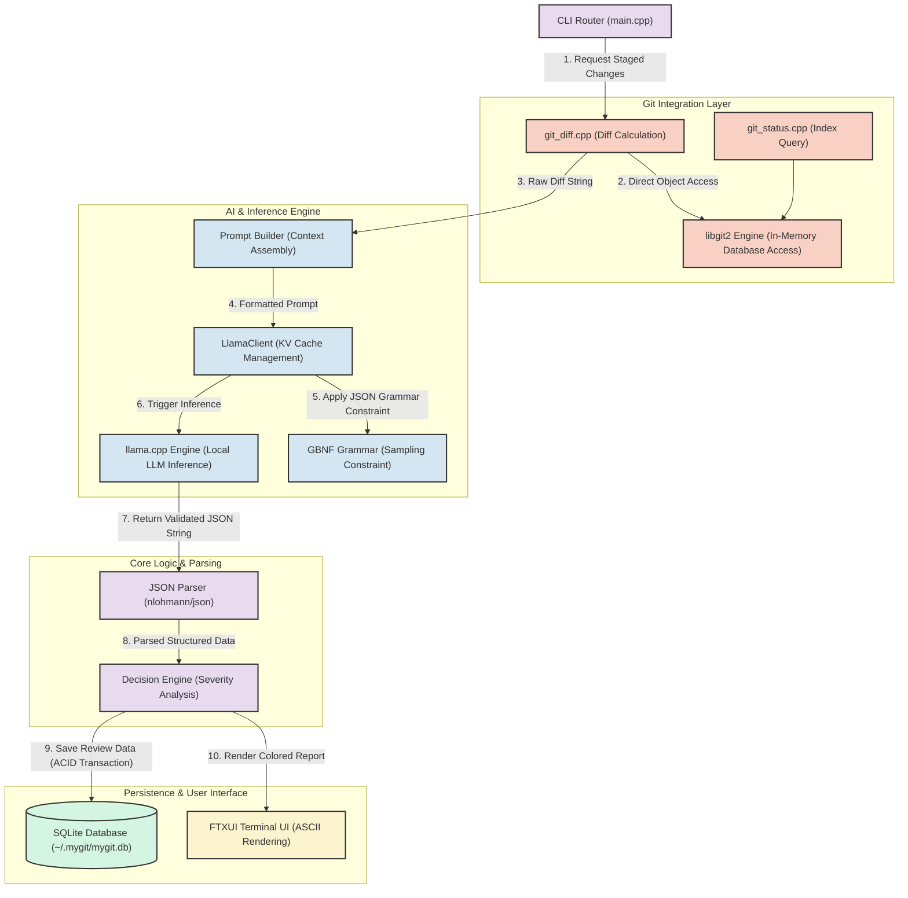
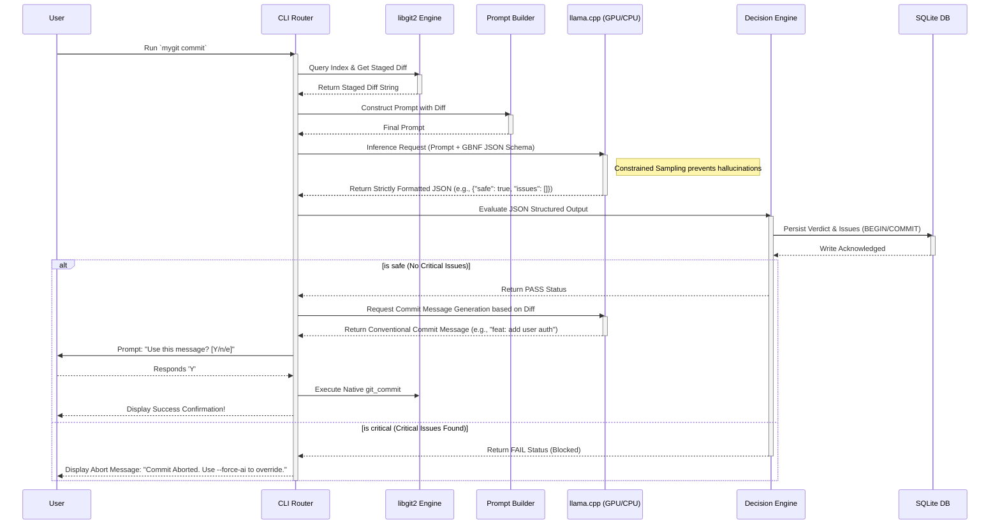

<div align="center">

# mygit
**The Ultimate AI-Powered Code Reviewer**

[](LICENSE.txt)
[](https://en.wikipedia.org/wiki/C%2B%2B20)
[](https://libgit2.org/)
[](https://github.com/ggerganov/llama.cpp)

A blazingly fast, C++20-native CLI wrapper around Git that enforces a strict, local LLM-powered code review pipeline *before* letting you push or commit your code.

**Zero Cloud. Zero API Keys. Zero Telemetry. 100% Local.**

</div>

---

## The Philosophy & Approach

When setting out to build `mygit`, the primary goal was to create a local LLM code reviewer that did not compromise on **speed, privacy, or reliability**.

**The Hurdles & Solutions:**
1. **Brittle Shell Commands:** Initially, using basic shell commands to extract git diffs proved incredibly brittle and prone to unpredictable parsing errors across different operating systems.
   * **The Fix:** Completely ripped out the shell integrations and natively embedded `libgit2`. This allows the tool to interface directly with the Git object database, pulling the exact index structures straight from memory without any subshell overhead.
2. **LLM Hallucinations & Parsing Errors:** Asking an AI model to return JSON usually results in random markdown blocks, trailing commas, or complete hallucinations that crash the parser.
   * **The Fix:** Deeply integrated `llama.cpp` and utilized GGML BNF (GBNF) grammars. By applying this grammar at the sampling layer, the model is mathematically forced to adhere strictly to the expected JSON schema. This completely eliminated parsing errors, allowing the decision engine to accurately and safely block commits based on severity levels.

By running inferences entirely on your own hardware via `llama.cpp` and `libgit2`, `mygit` guarantees total code privacy, zero network latency, and unparalleled reliability.

---

## Key Features & Technical Marvels

### Local AI Inference (`llama.cpp`)
No cloud, no API keys, no monthly fees, no network calls. `mygit` loads and runs `.gguf` language models entirely locally.
* **Hardware Acceleration:** Seamlessly offloads layers to the GPU (via CUDA/Vulkan) or falls back to highly optimized CPU inference.
* **Persistent Context:** The `LlamaClient` object manages its own KV cache and context, avoiding model reloading penalties across consecutive operations.

### Grammar-Constrained JSON (GBNF)
Instead of relying on fragile "prompt engineering", `mygit` uses GBNF (GGML BNF) grammars directly at the sampling level.
* The model is physically constrained and is mathematically incapable of generating anything other than our strictly defined JSON schema.
* **Zero parsing errors.** The JSON parser receives perfectly structured JSON objects every single time.

### Decision Engine & Verdicts
The code review parses the AI's feedback into structured severities (critical, high, medium, low).
* **Blocking Commits:** If the AI detects a critical severity issue (e.g., security vulnerability, hardcoded secret, fatal bug), `mygit` immediately halts the commit or push process.
* **Force Override:** Developers retain ultimate control. Passing the `--force-ai` flag explicitly overrides the AI's verdict.

### Auto-Generated Conventional Commits
Forget staring at a blank terminal trying to summarize your changes.
* Running `mygit commit` triggers the AI to analyze your staged diff and generate a Conventional Commit message (e.g., `feat(auth): add JWT validation`).
* **Interactive Flow:** You are prompted with the generated message: `Use this? [Y/n/e to edit]`.
  * `Y`: Uses the generated message instantly.
  * `e`: Opens your `$EDITOR` with the message pre-filled for tweaking.
  * `n`: Falls back to standard Git editor behavior.

### Native Git Integration (`libgit2`)
`mygit` does not shell out to the `git` CLI executable using brittle `popen` calls.
* **Direct C API:** Uses `libgit2` to directly traverse the Git object database, query the index, and calculate tree-to-index diffs purely in memory.
* **RAII Memory Safety:** All C-style `libgit2` pointers (`git_repository`, `git_diff`, `git_tree`) are wrapped in C++ `std::unique_ptr` with custom deleters, guaranteeing zero memory leaks.

### SQLite Review Memory System
Every review verdict is persisted to a local SQLite database (`~/.mygit/mygit.db`), establishing a long-term memory system.
* **Schema Auto-Creation:** `CREATE TABLE IF NOT EXISTS` ensures zero setup overhead.
* **ACID Transactions:** Inserts are bound by `BEGIN` and `COMMIT` block limits to ensure atomicity.
* **Prepared Statements:** Parameter-bound queries prevent SQL injection and ensure blazing fast writes.
* **View History:** The `mygit history` command renders a beautiful, colored ASCII table of your last 10 reviews using the `FTXUI` library.

---

## System Architecture

`mygit` is built using a highly modular C++20 architecture. Below is a detailed component diagram illustrating how data flows from the CLI to the underlying LLM and Git repository.


```mermaid
graph TD
    classDef git fill:#f9d0c4,stroke:#333,stroke-width:2px;
    classDef ai fill:#d4e6f1,stroke:#333,stroke-width:2px;
    classDef core fill:#e8daef,stroke:#333,stroke-width:2px;
    classDef db fill:#d5f5e3,stroke:#333,stroke-width:2px;
    classDef ui fill:#fcf3cf,stroke:#333,stroke-width:2px;

    CLI["CLI Router (main.cpp)"]:::core
    
    subgraph Git_Integration [Git Integration Layer]
        LibGit["libgit2 Engine (In-Memory Database Access)"]:::git
        GitDiff["git_diff.cpp (Diff Calculation)"]:::git
        GitStatus["git_status.cpp (Index Query)"]:::git
    end
    
    subgraph AI_Engine [AI & Inference Engine]
        PromptBuilder["Prompt Builder (Context Assembly)"]:::ai
        LlamaCPP["llama.cpp Engine (Local LLM Inference)"]:::ai
        LlamaClient["LlamaClient (KV Cache Management)"]:::ai
        GBNF["GBNF Grammar (Sampling Constraint)"]:::ai
    end
    
    subgraph Core_Logic [Core Logic & Parsing]
        DecisionEngine["Decision Engine (Severity Analysis)"]:::core
        Parser["JSON Parser (nlohmann/json)"]:::core
    end
    
    subgraph Persistence_UI [Persistence & User Interface]
        SQLite[("SQLite Database (~/.mygit/mygit.db)")]:::db
        FTXUI["FTXUI Terminal UI (ASCII Rendering)"]:::ui
    end

    CLI -->|"1. Request Staged Changes"| GitDiff
    GitStatus --> LibGit
    GitDiff -->|"2. Direct Object Access"| LibGit
    
    GitDiff -->|"3. Raw Diff String"| PromptBuilder
    PromptBuilder -->|"4. Formatted Prompt"| LlamaClient
    LlamaClient -->|"5. Apply JSON Grammar Constraint"| GBNF
    LlamaClient -->|"6. Trigger Inference"| LlamaCPP
    LlamaCPP -->|"7. Return Validated JSON String"| Parser
    
    Parser -->|"8. Parsed Structured Data"| DecisionEngine
    DecisionEngine -->|"9. Save Review Data (ACID Transaction)"| SQLite
    DecisionEngine -->|"10. Render Colored Report"| FTXUI
```

## The Review Workflow

Here is a detailed sequence diagram illustrating exactly what happens when you run `mygit commit`:


```mermaid
sequenceDiagram
    participant User
    participant CLI as CLI Router
    participant LibGit2 as libgit2 Engine
    participant PromptBuild as Prompt Builder
    participant LlamaCPP as llama.cpp (GPU/CPU)
    participant Decision as Decision Engine
    participant DB as SQLite DB

    User->>CLI: Run `mygit commit`
    activate CLI
    
    CLI->>LibGit2: Query Index & Get Staged Diff
    activate LibGit2
    LibGit2-->>CLI: Return Staged Diff String
    deactivate LibGit2
    
    CLI->>PromptBuild: Construct Prompt with Diff
    activate PromptBuild
    PromptBuild-->>CLI: Final Prompt
    deactivate PromptBuild
    
    CLI->>LlamaCPP: Inference Request (Prompt + GBNF JSON Schema)
    activate LlamaCPP
    Note right of LlamaCPP: Constrained Sampling prevents hallucinations
    LlamaCPP-->>CLI: Return Strictly Formatted JSON (e.g., {"safe": true, "issues": []})
    deactivate LlamaCPP
    
    CLI->>Decision: Evaluate JSON Structured Output
    activate Decision
    Decision->>DB: Persist Verdict & Issues (BEGIN/COMMIT)
    activate DB
    DB-->>Decision: Write Acknowledged
    deactivate DB

    alt is safe (No Critical Issues)
        Decision-->>CLI: Return PASS Status
        CLI->>LlamaCPP: Request Commit Message Generation based on Diff
        activate LlamaCPP
        LlamaCPP-->>CLI: Return Conventional Commit Message (e.g., "feat: add user auth")
        deactivate LlamaCPP

        CLI->>User: Prompt: "Use this message? [Y/n/e]"
        User-->>CLI: Responds 'Y'

        CLI->>LibGit2: Execute Native git_commit
        CLI-->>User: Display Success Confirmation!
    else is critical (Critical Issues Found)
        Decision-->>CLI: Return FAIL Status (Blocked)
        deactivate Decision
        CLI-->>User: Display Abort Message: "Commit Aborted. Use --force-ai to override."
    end
    deactivate CLI
```

---

## The Roadmap: Advanced Features & Optimizations

We are moving from a **CLI Tool** to a true **AI Daemon**. Here is what is on the horizon:

### 1. Repository-Aware Context (RAG)
Currently, the AI operates on raw diffs. We are implementing a lightweight RAG pipeline to generate repository-aware context.
* **Multi-Language Tree-sitter Grammars:** AST-level symbol extraction for C++, Python, JS/TS, Go, Rust, etc.
* **Universal Text-Chunking:** Fallback for unrecognized file types.
* **FAISS Vector Store:** Indexed code units embedded locally (e.g., via Qodo Embed 1.5B with ONNX).

### 2. Rename-Aware Change Detection
File renames currently look like deletions and additions, bloating the context window.
* **libgit2 Rename Detection:** (`git_diff_find_similar()`) will identify pure file relocations, excluding unchanged contents from the analysis prompt.

### 3. Pipeline Acceleration
* **Prefix KV Caching:** Cache the system prompt and GBNF grammar state to eliminate repeated evaluation latency.
* **Batched Per-File Processing:** Split large multi-file diffs into independent batches for parallel CUDA review, then aggregate.
* **Daemonized Architecture:** Eliminate the cold-start penalty by spawning a lightweight background process that holds the model in VRAM persistently.

### 4. Smart Diff Acceptance
Preventing the model from analyzing excessive diffs or binary/non-text files (like large documentation or `.md` files) to save computation.

### 5. The "Agentic" Shift (V4/V5)
* **Patch Generation & Safe Auto-Fix:** `mygit` will generate Git-compatible unified patches for detected problems, allowing one-command fixes upon user approval.

---

## Commands

| Command | Description |
|---------|-------------|
| `mygit setup` | Interactive prompt to configure your model path and GPU layer count. |
| `mygit install` | Self-installs the executable to `~/.mygit/bin` and updates your system PATH. |
| `mygit review` | Analyzes staged changes and prints a colored report to the terminal. |
| `mygit commit` | Runs a review. If it passes, generates a commit message, and commits. |
| `mygit commit -m "msg"` | Runs a review. If it passes, commits using your provided message. |
| `mygit push <remote> <branch>` | Runs a review. If it passes, pushes the code upstream. |
| `mygit history` | Displays a table of your most recent AI reviews and verdicts. |

> **Override Flag:** Append `--force-ai` to `commit` or `push` to bypass blocking issues.

---

## Prerequisites & Setup

1. **Compiler:** C++20 compatible compiler (MSVC 19.3+, GCC 13+, Clang 17+)
2. **Build System:** CMake 3.21+ & Ninja
3. **Package Manager:** vcpkg installed and bootstrapped (Optional, standard dev headers work too).

### Building from Source

```bash
git clone <this repo>
cd AI_code_reviewer_git

# Configure CMake
cmake -B build -S . -DCMAKE_BUILD_TYPE=Release

# Build the executable
cmake --build build
```

### Configuration & Models

You must provide `mygit` with a compatible `.gguf` model. (We recommend Qwen2.5-Coder-1.5B-Instruct for lightning-fast, high-quality local reviews).

Run the setup command to configure the model path and GPU layers (use `99` to offload the entire model to the GPU for maximum speed):

```bash
./build/mygit setup
```

Once configured, install `mygit` to your system PATH:

```bash
./build/mygit install
```

Restart your terminal, and you can now run `mygit` from anywhere!

---

## RAG Setup Guide (Optional)

By default, `mygit` runs in **zero-RAG fallback mode**. If `models/embedding_model.onnx` and `models/tokenizer.json` are missing, it falls back gracefully. To enable real retrieval:

### Step 1: Get an embedding model
Download an embedding model (e.g., Qodo-Embed-1-1.5B) and export it to ONNX format using the provided scripts.
```bash
git lfs install
git clone https://huggingface.co/Qodo/Qodo-Embed-1-1.5B model_customization/Qodo-Embed-1-1.5B
python -m venv model_customization/venv
model_customization/venv/bin/pip install torch transformers onnx onnxruntime
model_customization/venv/bin/python scripts/export_embedding_model_onnx.py
```
This produces the necessary `.onnx` and `tokenizer.json` files in the `models/` directory. `mygit` will automatically detect them on the next run.

### Step 2: GPU-accelerated embeddings (optional)
For GPU acceleration, install cuDNN manually and rebuild `onnxruntime` with CUDA using the provided vcpkg overlays.
```bash
export VCPKG_OVERLAY_PORTS="<repo>/vcpkg-overlays"
cmake -B build -S . -DVCPKG_MANIFEST_FEATURES=onnx-cuda -DMYGIT_ENABLE_ONNX_CUDA=ON
cmake --build build --target mygit
```

---

## How Codex & GPT-5.6 Were Used

This project was built with OpenAI Codex (powered by GPT-5.6) as the primary development partner, using a spec-first workflow:

* **Spec-first feature development:** Every major module began as a written prompt spec handed to Codex. The actual working prompt library is checked into this repo at `docs/prompts.md`.
* **Module scaffolding and iteration:** Codex generated first implementations of the subsystems, which were then reviewed, tightened, and integrated by hand. The architecture and its constraints live in `docs/architecture_review.md`.
* **Toolchain debugging:** GPT-5.6 was used heavily to diagnose build failures (documented in `vcpkg-overlays/onnxruntime/`).
* **The dogfooding loop:** AI-written code did not get a free pass: every commit produced with Codex was reviewed by `mygit` itself before it was allowed into the repo. AI wrote the code, and an AI gatekeeper judged it.
